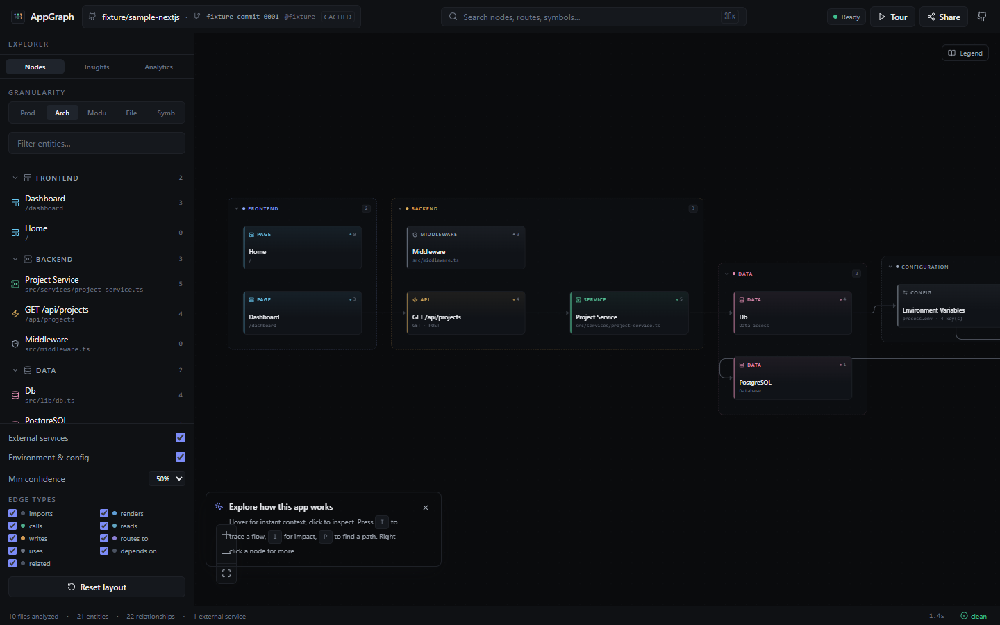
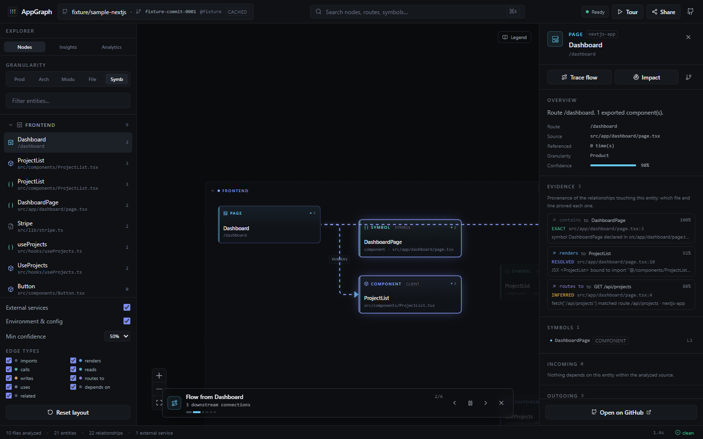
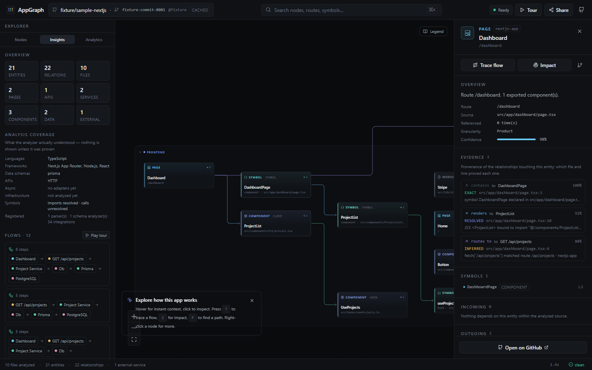
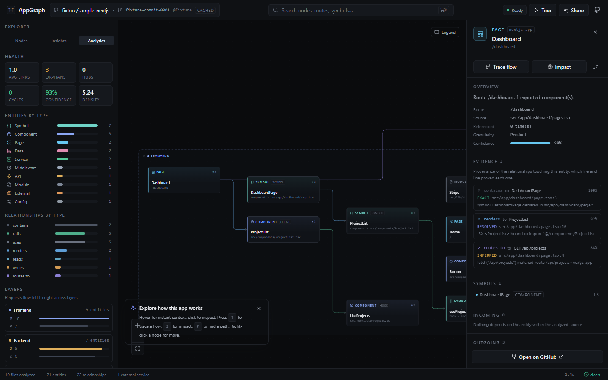
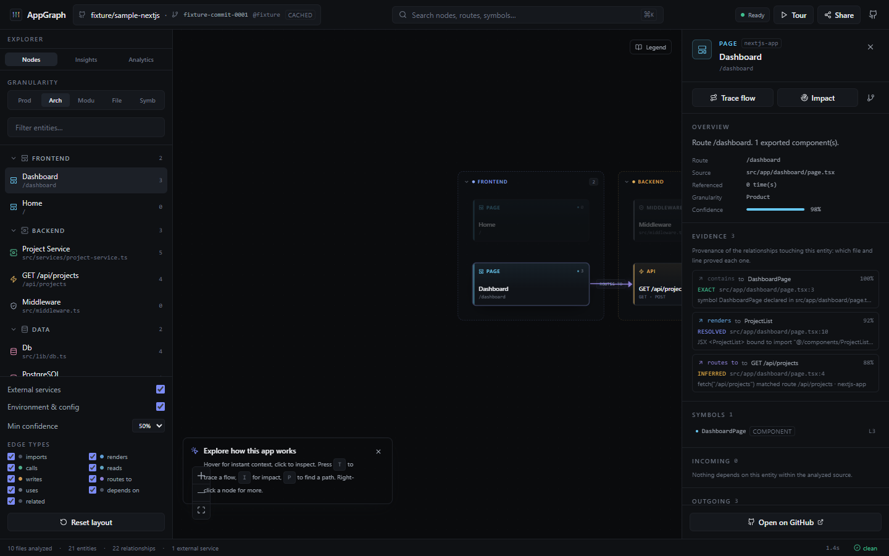
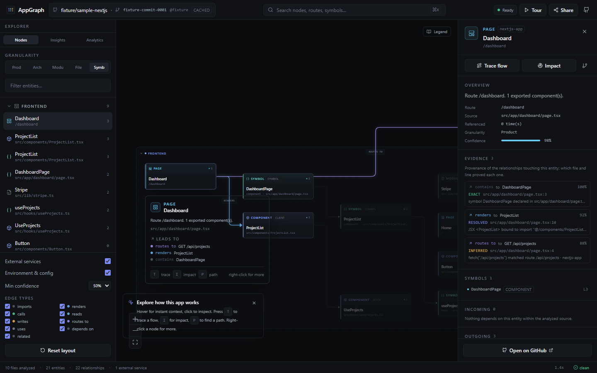
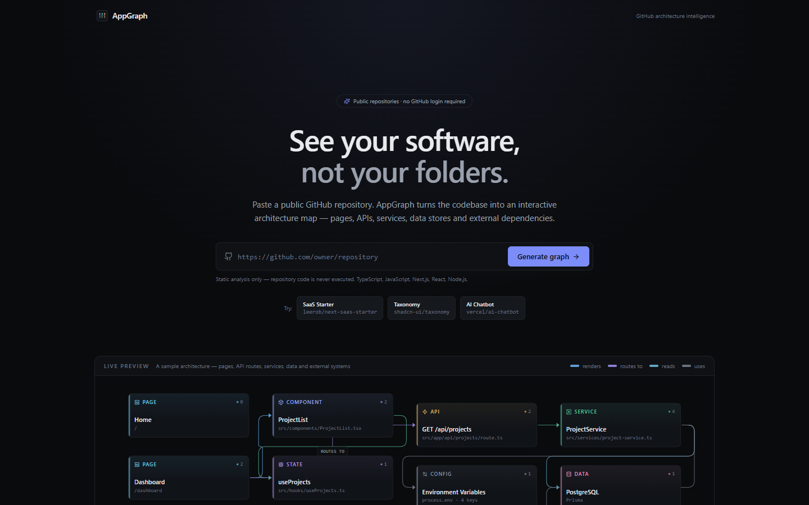

<div align="center">

# AppGraph

**See your software, not your folders.**

Turn a public GitHub repository into an interactive architecture graph — pages, API routes,
services, databases and external services, connected and explorable in the browser.

[](https://github.com/hi77x/appgraph/actions/workflows/ci.yml)
[](LICENSE)
[](https://nextjs.org)
[](https://www.typescriptlang.org)
[](https://reactflow.dev)
[](#contributing)

[Quick start](#quick-start) · [Features](#features) · [Screenshots](#screenshots) · [CLI](#cli) · [How it works](#how-it-works) · [Security](#security-model) · [Testing](#testing) · [Contributing](#contributing)

</div>

---



## What is AppGraph?

Repositories are usually consumed as files and folders. AppGraph adds another representation:
`repository → semantic software graph`.

Paste a public GitHub URL and AppGraph statically analyzes the codebase, then renders an interactive
map that answers:

- What are the important parts of this application?
- How are pages connected to components and APIs?
- Which API routes call which services?
- Which modules read or write to the database?
- Where do environment variables enter?
- What depends on this module, and what breaks if it changes?

No GitHub login is required for public repositories. Analysis is **deterministic static analysis** —
no LLM, no code execution, no `npm install` of the analyzed repository.

## Features

### 🧭 Semantic graph, not a file tree
- Entities: **pages, components, hooks, API routes, services, middleware, state, config,
  databases, external services, modules**.
- Typed relationships with confidence scores: `renders`, `routes_to`, `calls`, `reads`, `writes`,
  `uses`, `imports`, `depends_on`.
- Four granularities: **Product → Architecture → Modules → Files**.

### 🔍 Trust through evidence
- Every relationship carries provenance: source file, line range, analyzer id, rule id and
  how it was established (`exact` / `resolved` / `inferred`) with a human-readable reason.
- The Inspector **Evidence** panel links each record to the exact GitHub line pinned to the
  analyzed commit, so you can always answer *"why are these two connected?"*.
- No invented links: unsupported constructs stay unsupported and are reported honestly in
  **Insights → Analysis coverage** (what the analyzer actually understood).
- Graph schema and rule ids are documented in [docs/graph-schema.md](docs/graph-schema.md).

### 🗺️ Architecture intelligence
- **Trace flows** (`T`) — animated, step-by-step playback of what a page/API/service leads to,
  with a camera that follows each hop.
- **Impact analysis** (`I`) — reverse reachability: what depends on this entity if it changes.
- **Path finder** (`P`) — shortest relationship path between any two entities.
- **Detected flows + guided tour** — automatic end-to-end chains such as
  `Dashboard → /api/projects → Project Service → Db → Prisma → PostgreSQL`.
- **Circular dependency detection** with replayable cycles.
- **Hover cards** — instant relationship context on every entity.

### 📊 Analytics & export
- Health metrics: average links, orphans, hubs, cycles, confidence, density.
- Charts: entities by type, relationships by type, per-layer traffic (in/out).
- Export the graph as **Mermaid**, **JSON** or a **Markdown architecture report**.

### 🎨 Premium canvas
- Railway-inspired dark UI, deterministic ELK lane layout (Frontend → Backend → Data →
  Configuration → External), smoothstep edges, animated traces, minimap, command palette (`⌘K`),
  legend (`L`), right-click context menu, keyboard-first navigation.

### 🔌 Framework-aware analysis
- Next.js **App Router** and **Pages Router** (routes, layouts, route handlers, middleware).
- React components and hooks, Node.js services.
- Recognized SDKs become explicit nodes: Stripe, Prisma, Drizzle, Supabase, Firebase, Clerk,
  Auth.js, pg, MongoDB, Redis, AWS S3, OpenAI, Anthropic, Resend, PostHog, Sentry and more.

## Screenshots

| Flow tracing | Insights & detected flows |
| --- | --- |
|  |  |

| Analytics | Inspector |
| --- | --- |
|  |  |

| Hover context | Landing |
| --- | --- |
|  |  |

## Quick start

```bash
git clone https://github.com/hi77x/appgraph.git
cd appgraph
npm install
npm run dev
```

Open **http://localhost:3000** and paste a public GitHub repository URL.

Production:

```bash
npm run build
npm start
```

### Environment variables

Copy `.env.example` to `.env` and adjust as needed:

| Variable | Required | Purpose |
| --- | --- | --- |
| `GITHUB_TOKEN` | no | Server-side GitHub token (read-only). Without it AppGraph still works for public repos, but shares the unauthenticated 60 req/h limit. Never sent to the browser. |
| `APPGRAPH_CACHE_DIR` | no | Filesystem cache directory (default `<project>/.appgraph-cache`). |
| `APPGRAPH_ANALYSIS_VERSION` | no | Bump to invalidate cached analyses after analyzer changes. |
| `APPGRAPH_ANALYZE_RATE_LIMIT` | no | Analyses per 5 minutes per client (default `12`). |
| `APPGRAPH_MAX_CONCURRENT_ANALYSES` | no | In-process analysis concurrency (default `3`). |

## CLI

Analyze a repository without the UI — useful for scripts and CI:

```bash
# Summary + progress in the terminal
npm run analyze -- nextjs/saas-starter

# Machine-readable summary (health, flows, cycles)
npm run analyze -- nextjs/saas-starter --json

# Full graph document + Mermaid diagram + Markdown report
npm run analyze -- nextjs/saas-starter \
  --out graph.json \
  --report architecture.md \
  --mermaid
```

Input accepts `owner/repo` or a full `https://github.com/owner/repo` URL.

## How it works

```
GitHub URL
   ↓  strict URL validation (github.com only, SSRF-safe)
Repository Provider (official GitHub REST API)
   ↓  metadata · commit SHA · recursive tree
File selection & classification (limits, ignored dirs, budgets)
   ↓  raw.githubusercontent.com (no API rate-limit cost)
TypeScript AST parsing + import resolution (tsconfig paths, index files, workspaces)
   ↓
Framework adapters (Next.js, React, Node) + integration detection
   ↓
Semantic graph builder (entities, typed edges, confidence, groups)
   ↓
ELK layered layout per granularity (lane partitioning)
   ↓
Graph JSON → interactive canvas
```

- **3 GitHub API requests** per analysis (metadata, commit, tree); file contents come from
  `raw.githubusercontent.com`.
- Results are cached by `github:{owner}:{repo}:{commitSha}:{analysisVersion}` — re-analyzing the
  same commit is instant and does not touch GitHub again.
- Large repositories degrade to a **partial graph with explicit warnings** instead of failing.

### Project structure

```
src/
  app/                    Next.js App Router (landing, workspace, API routes)
  components/             Canvas, explorer, inspector, search, workspace shell, landing
  features/workspace/     Client state, trace/path/flow algorithms, analytics
  lib/
    github/               URL parsing, provider abstraction, limits, fixture provider
    analysis/             Pipeline, classifier, TS parser, resolvers, frameworks, graph builder
    graph/                Graph model + ELK layout engine
    cache/                Filesystem/in-memory JSON cache
tests/
  unit/ integration/ e2e/ Vitest + Playwright suites with a fixture repository
scripts/analyze.ts        CLI entry point
```

## Security model

Repository analysis is **static analysis only**.

- Repository code is never executed, installed, imported or written to disk.
- Strict GitHub URL parsing — no arbitrary URL fetching, no generic proxy (SSRF-safe).
- Request timeouts, response/byte limits, bounded concurrency, node/edge caps.
- Environment variable **names** may be surfaced; values are never read or stored.
- No secrets in server logs or the client bundle.

## Supported repositories

| | Status |
| --- | --- |
| Public GitHub repositories | ✅ |
| TypeScript / JavaScript (`.ts .tsx .js .jsx .mjs .cjs .mts .cts`) | ✅ |
| Next.js (App Router + Pages Router), React, Node.js | ✅ |
| Private repositories, GitLab, Bitbucket, uploaded archives | 🔜 via `RepositoryProvider` |
| Other languages | 🔜 via framework adapters |

## Testing

```bash
npm run typecheck    # TypeScript project check
npm test             # 71 unit + integration tests (Vitest, fixture-based, no network)
npm run build        # production build
npm run test:e2e     # Playwright E2E (build first; uses installed Edge by default)
```

- Unit: URL parsing, classifier, import resolver, TS parser, integrations, trace/path algorithms,
  analytics (health, cycles, Mermaid).
- Integration: full pipeline against `tests/fixtures/sample-nextjs` (pages, APIs, services,
  Prisma/Postgres, Stripe, env vars, layouts, cache).
- E2E: landing, workspace interactions, tracing/impact/path/tour, analytics & exports, hover
  cards, legend, context menu, mobile sheets.
- Live GitHub check (opt-in): `APPGRAPH_LIVE_TEST=1 npx vitest run tests/manual/live-github.test.ts`.

## Docker

The Dockerfile builds with Next.js standalone output and runs as a non-root user:

```bash
docker build -t appgraph .
docker run -p 3000:3000 -e GITHUB_TOKEN=... appgraph
```

## Keyboard shortcuts

| Key | Action |
| --- | --- |
| `⌘/Ctrl + K` | Command palette |
| `T` / `I` / `P` | Trace flow / Impact / Find path |
| `F` / `R` | Fit graph / Reset layout |
| `L` | Toggle legend |
| `Space` | Play/pause the active trace |
| `Esc` | Stop trace / clear selection |
| `1–5` | Product / Architecture / Modules / Files / Symbols |

## Known limitations

- Public repositories only (no OAuth yet).
- TS/JS ecosystems only; other languages need new adapters.
- Heuristic relationships are scored with confidence and marked as inferred in the inspector.
- Extremely large repositories are bounded and produce a partial graph with warnings.
- Job state and cache are per-process; multi-instance deployments should add a shared store.

## Contributing

Contributions are welcome! Ideas that fit the roadmap:

- New framework adapters (`Vue`, `Svelte`, `Nuxt`, `Nest`, `Express` patterns).
- Language adapters behind the existing parser interface (`parsers/`).
- More integration detectors in `src/lib/analysis/integrations.ts`.
- Graph layouts, canvas interactions and accessibility improvements.

Before opening a PR:

```bash
npm run typecheck && npm test && npm run build
```

Please keep pull requests focused and include tests for analyzer changes
(`tests/fixtures/sample-nextjs` is a good place to extend fixtures).

## Roadmap

- GitHub OAuth and private repositories.
- Graph diff between commits and PR architecture review.
- Change-impact analysis and architecture history.
- AI natural-language queries over the graph (optional layer on top of deterministic analysis).
- GitLab / Bitbucket providers.

## License

[MIT](LICENSE) © 2026 Itmsx-v

<div align="center">
<sub>Built with Next.js, React Flow and ELK. Static analysis only — your code never leaves GitHub.</sub>
</div>
